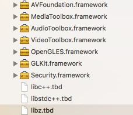
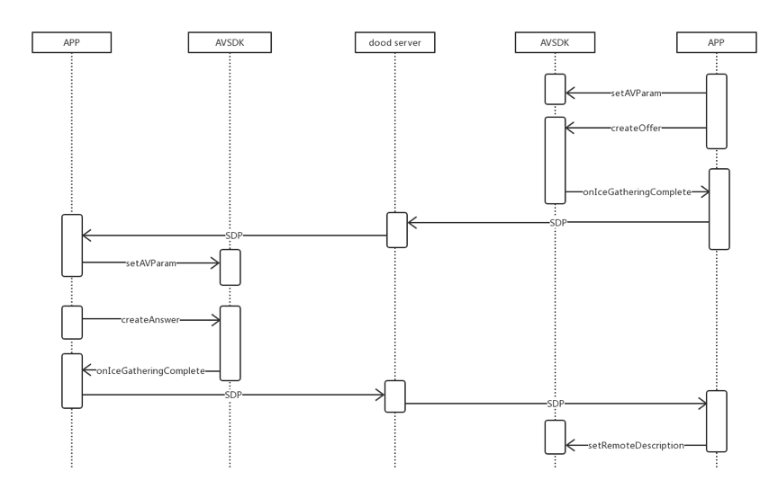

#AVSDK概述


LinkdoodAVSipSDK 是北信源软件股份有限公司为移动设备通话的即时通讯开发框架，实时通话分为语音通话和视频通话，将音频通讯进行数据流量化。


#AVSDK功能

* 视频聊天（基本会话创建、控制、摄像头切换）
* 语音聊天（基本会话创建、控制、听筒外音切换、静音等功能）


#AVSDK-接口介绍及使用说明

*注意:AVSDK库使用说明*
* 目前该版本的库支持一对一视频和音频通话，主要功能接口：音视频通话接口(文档后续说明建立过程及对应接口)，通话中功能接口:挂断，拒接，静音，摄像头切换，听筒外音切换(蓝牙),停止视频采集（视频通话中转音频,参数获取(码率，帧率等详细参数参照相关头文件AVConfig);
 * 音视频的库需要依赖系统类库，在使用前必须导入以下的类库 




 * iOS10 需要添加访问权限

```

 Privacy - Camera Usage Description //相机权限
 Privacy - Microphone Usage Description//麦克风权限
 Privacy - Speech Recognition Usage Description//麦克风权限
 Privacy - Bluetooth Peripheral Usage Description//蓝牙权限
```

##AVSDK使用流程：
 调用时序图：



 1. 库相关:

    * 项目中引入 *AVSDK.framework*（**导库的时候请仔细检查库是否导入，以及库的路劲是否准确**;
    * 需要使用音视频的地方导入 *#import \<AVSipSDK/AVSipSDK.h\>* 即可;

 2. 创建AVObject对象(主接口文件)：

    ```
      @property (nonatomic, strong)AVObject *avObject;

    ```
 3. 实例化，并设置相关代理

    ```
       self.avObject  = [[AVObject alloc]init];
       [self.avObject setDelegate:self];
       //<AVObjectDelegate>

    ```
 4. 参数设置(iOS是使用对象来存储需要的参数)：

     ```
         AVParamsModel *model = [[AVParamsModel alloc]init];
         if (self.isVideo) {//音频不用设置
        //这里对远端和本地视频View的创建，推荐使用纯代码创建
              self.videoView.frame  =  CGRectMake(0, 0, SCREEN_WIDTH, SCREEN_HEIGHT);
              self.cameraView.frame =  CGRectMake(0, kLocalVideoViewMarginY, SCREEN_WIDTH/4, SCREEN_HEIGHT/6);
             //(1) 传递远端和本地视频View
              model.paramLocalView = self.cameraView;
              model.paramRemoteView = self.videoView;
            //(2) 视频通话时，该参数必须设置
               model.paramOpenVideo = YES;

               }
        //(3) 打洞服务器（可以不用设置 默认为公网服务器）
        //该地址只是示例，
        model.paramIceServer = @"110.14.155.00";
        model.paramIcePort   = @"1234";
        model.paramIceUser   = @"admin";
        model.paramIcePwd    = @"admin";
       //(4) 参数设置
       [self.avObject setAVParam:model];
     ```
5. 主接口调用

      * 主叫端(发起通话请求)调用接口;

        ```
         [self.avObject createOffer];

        ```
      * 被叫端(接听方)调用接口:

      ```
      /******************
        1. 这里的接口调用顺序一定不能反；
        2. 接听端的最后一个参数一定要是“offer”；
        3. sdpString(该值在后面有说明)是需要呼叫方发过来的参数；
      ********************/
       [self.avObject setRemoteSDP:self.sdpString type:@"offer"];
       [self.avObject createAnswer];//接听
      ```
 
6. 收到被叫端sdp后调用:
   
   ```
    [avsipObject setRemoteSDP:self.sdpString type:@"answer"];
   ```
   
7. 接通后会回调该方法：

  ```
    //参数在后面有说明
      - (void)sipObject:(AVSipObject *)sipObj didReceiveCallBackStatus：(MSG_TYPE)status;
     //异常错误状态回调
      - (void)sipObject:(AVSipObject *)sipObj errorStatu:(NSString *)errorType;
  ```
  
8. 参数回调(sdp):

    
  ```
  // 主叫端调用**createOffer**或被叫端调用**createAnswer**后会回调该方法：
  //接口参数说明在后面接口说明里
   -(void)objectClient:(AVObject *)obj didReceiveCallBackSDPString:(NSString *)sdpString withSDPType:(NSString *)type{
     //发送一条消息(将SDP发送给对方，调用setRemoteSDP设置参数）
     if (![sdpString isEqualToString:@" " ] || !sdpString) {
                     
         }else{
        }
    }

 }

 ```
 
##AVSDK头文件：

1. 所有接口文件


2. AVObject 库主要文件，音视频主要接口都在改文件中，所有接口介绍在（三）介绍；
3. AVConfig处理所有枚举和常量值；

4. AVParamsModel 所有音视频参数通过该模型类传递;

5. AVSDK 包含所有项目头文件，工程使用类库时，只需要引入该头文件；

##主接口文件:


* 初始化参数设置  

```
/**
*  音视频初始化参数设置
*
*  @param params 参数
*
*/
- (void)setAVParam:(AVParamsModel*)params;

```
* 呼叫

```
/**
*  呼叫时 调用
*/
- (void)createOffer;

``` 

*  接听

```
/**
*  应答时 调用
*/
- (void)createAnswer;

```

* 前后置摄像


```
/**
*  前后摄像头切换
*/
- (void)switchCamera; 

```
* 静音设置

``` 
/**
*  静音设置（麦克风）
*
*  @param isEnableMic yes 开启
*/
-(void)setMicrophone:(BOOL) isEnableMic;

``` 

* 外音听筒切换

``` 
/**
*  外音听筒切换
*
*  @param isEnableSpeaker 默认外音 no:开启听筒(蓝牙)
*/
- (void)setSpeaker:(BOOL) isEnableSpeaker;

``` 

* 视频采集开关

```
/**
*  视频采集开关
*
*  @param isEnableCapture
*/
- (void)setCaptureEnable:(BOOL)isEnableCapture; 

``` 

* SDP参数设置 

```
/**
sdp参数设置

@param sdp sdp参数
@param type 参数类型
*/
-(void)setRemoteSDP:(NSString *)sdp type:(NSString*)type; 

``` 


* 资源释放

``` 
- (void)destroy;

```


* 音视频数据获取

```
/**
*  音视频数据获取
*  数据接通后，音视频参数及设备状态回掉
*  @param timerHandler 数据回调
*/
- (void)getStatsWithBlock:(void (^)(NSDictionary *stats))response; 


```
*注:字典的键获取在AVConfig（不用再次导入）中,解析参照:*
 ```
  - (NSString *)statsStringWithDic:(NSDictionary*)dic {
          NSMutableString *result = [NSMutableString string];

          NSString *videoSendFormat = @"发送帧率:%@;码率:%@;分辨率:%@X%@\n";

          [result appendString:[NSString stringWithFormat:videoSendFormat,dic[kStatsValueNameFrameRateSend],dic[kStatsValueNameFrameBitrateSend],
          dic[kStatsValueNameFrameWidthSend], dic[kStatsValueNameFrameHeightSend]]];

           // Video receive stats.
           NSString *videoReceiveFormat = @"接收帧率:%@;码率:%@;分辨率:%@X%@\n";
            [result appendString:[NSString stringWithFormat:videoReceiveFormat,dic[kStatsValueNameFrameRateReceived], dic[kStatsValueNameFrameBitrateReceived], dic[kStatsValueNameFrameWidthReceived], dic[kStatsValueNameFrameHeightReceived]]];


      return result;
}

 ```

##回调接口:

* 回调返回状态

```
/**
*  svsdk 回调返回状态
*
*  @param obj sdk接口类
*  @param status 状态回调

*/

-(void) objectClient:(AVObject*)obj didReceiveCallBackStatus:(MSG_TYPE)status; 

``` 


* sdp数据

``` 
/**
*  svsdk 回调sdp数据
*
*  @param obj sdk接口类
*  @param sdpString 回调sdp数据
*  @param type  是主叫还是被叫(answer和offer)
*/

-(void) objectClient:(AVObject*)obj didReceiveCallBackSDPString:(NSString*)sdpString withSDPType:(NSString*)type; 


```


* 错误信息返回

```
/**
*  音视频 错误信息返回
*
*  @param obj sdk接口类
*  @param errorType 错误状态
*/

-(void) objectClient:(AVObject*)obj errorStatu:(NSError*)error;
 


```

#时序图

#AVSDK接口与功能

void SetAVParam(const AVParam param);

#####功能：设置AVSDK的参数

* paramLocalRender		本地SurfaceView
* paramRemoteRender		远端SurfaceView
* paramLocalLayout		
* paramRemoteLayout		
* paramActivity			
* paramIceServer		打洞服务器ip
* paramIcePort			打洞服务器端口
* paramIceUser			打洞服务器用户名
* paramIcePwd			打洞服务器密码
* paramOpenAudio		是否打开音频
* paramOpenVideo		是否打开视频

int RegisterUserCallBack(UserCallBack ulistener)
<br/>功能：设置回调函数

int CreateOffer();
<br/>功能：主叫端向被叫端发起音视频通话请求，生成SDP

int CreateAnswer();
<br/>功能：被叫端接收到主叫端的SDP，做出响应并生成SDP

int SetRemoteDescription(String sdp);
<br/>功能：主叫端接收到被叫端的SDP，并进行设置

void Destroy();
<br/>功能：释放webRTC资源，在结束通话时使用

void SwitchCamera(bool enable);
<br/>功能：切换摄像头

void SetMicrophone(boolean isEnableMic)
<br/>功能：静音

void SetSpeaker(boolean isEnableSpeaker)
<br/>功能：听筒外音切换

#回调

void onIceGatheringComplete(String sdp);
<br/>功能：AVSDK将生成的SDP回调给应用层

void onIceConnected();
<br/>功能：连接成功

void onIceDisconnected();
<br/>功能：断开连接

void onPeerConnectionError(String description);
<br/>功能：错误信息e