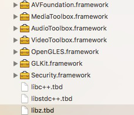

#RTCSDK(iOS)

##1. RTCSDK简介
###1.1 描述
 RTCSDK提供一对一和多对多的音视频会话与数据发送接收功能。如图1所示，图1(a)中展示的是A与B两点之间的音视频会话，图1(b)中展示的是A、B和C三点的音视频会话。
  
图1.RTCSDK的音视频会话功能：

###1.2 主功能
主要功能接口：音视频通话接口(文档后续说明建立过程及对应接口)，通话中功能接口:挂断，拒接，静音，摄像头切换，听筒外音切换(蓝牙),停止视频采集，参数获取(码率，帧率等详细参数参照相关头文件AVConfig)；视频转语音接口。

###1.3 依赖库和接口结构
RTCSDK以静态库和头文件的形式提供，目录结构如下：

(1) 类库结构

(2) 依赖库

##2. RTCSDK音视频会话的建立
###注意:
* 项目中引入 RTCSDK.framework（导库的时候请仔细检查库是否导入，以及库的路劲是否准确）;
* 需要使用音视频的地方导入 #import < RTCSDK / RTCSDK.h>即可;
* 创建对象：
 
    类库主接口文件对象：

    @property(nonatomic, strong) RTCSDKClient *avClient;
   
    类库主接口参数设置文件对象：

    @property(nonatomic, strong) AVParamsModel *model;
###2.1 两点
A与B两点之间音视频会话的建立如图2所示。其中A是主叫，B是被叫。

图2.两点音视频会话的建立

步骤：
1.主叫A调用RTCSDK接口CreatePeer，传入参数AVParamModel，其中参数paramSessionID为被叫B的ID，参数paramSDP为NULL。（详见3.2RTCSDK参数）

2.RTCSDK回调接口onRTCSDKMessage，其中sessionID为被叫B的ID，消	息类型type为MSG_CALLBACK_SDP_OFFER(枚举值)，消息msg为生成的sdp。

3.4. 将sdp传递至被叫。

5.被叫调用RTCSDK接口CreatePeer，传入参数AVParamModel，其中参数paramSessionID为主叫A的ID，参数paramSDP为A生成的sdp。

6.RTCSDK回调接口onRTCSDKMessage，其中sessionID为被叫A的ID，消息类型typ为MSG_CALLBACK_SDP_ANSWER (枚举值)，消息msg为生成的sdp。

7.8. 将sdp传递至主叫。

9.主叫调用RTCSDK接口SetRemoteDescription，其中参数sessionID为	被叫B的ID，参数sdp为B生成的sdp。

10.音视频连通，主叫和被叫的RTCSDK会通过接口onRTCSDKMessage回	调MSG_ICE_CONNECTION(枚举值)。
###2.2 多点
多点音视频会话的建立与两点类似。以三点的音视频会话为例，如图1(b)所示，C在A与B已经建立完成音视频会话的基础上，再分别与A和B进行两点间的音视频会话的建立。
##3.RTCSDK接口
###3.1 创建与销毁RTCSDK
####3.1.1 创建
		//对象实例化
		_avClient  = [[RTCSDKClient alloc]init];
		//设置代理
		[self.avClient setDelegate:self];
		//创建
		[self.avClient createPeer:self.model];

####3.1.2 销毁
		/**
		  @param sessionID 多点时候全部销毁传nil或@””
		  销毁某个链接为当前的用户id
		*/
		-(void)destroyPeer:(NSString*)sessionID;

####3.1.3 回调接口
		/**
		 @param obj sdk对象
		 @param status 回调状态:sdp/链接状态/错误状态(状态码) 详见枚举介绍
		 @param msg  状态为sdp时：返回sdpString;错误P:返回string类型错误码
		 @param sessionID 区分每一个链接的用户
		*/
		- (void)onRTCSDKMessage:(MSG_TYPE)status msg:(NSString*)msg sessionID:(NSString*)sessionID;
		/**
		  枚举值
		*/
		typedef NS_ENUM(NSInteger,MSG_TYPE) {//回调消息
		MSG_CALLBACK_SDP_ANSWER = 101, //呼叫或者接听后返回的字符
		MSG_CALLBACK_SDP_OFFER  = 102, //呼叫或者接听后返回的字符
		MSG_ICE_CONNECTION      = 103, //数据联通
		MSG_ICE_DISCONNECTION   = 104, //数据断开
		MSG_ICE_FAILES           = 105, //数据链接失败（资源释放最好在该状态中）
		MSG_PEERCONNECTION_ERROR = 106  //呼叫数据出错
		};

###3.2 RTCSDK(AVParamsModels)参数

		//呼叫方和接听方在createPeer的时候都需要一个本地的窗口和远端的窗口；
		//只需要在创建的时候传递一次
		@property(nonatomic,strong)UIView *paramLocalView;
		//在创建的时候传递一次,多人每加入一人都需传入该参数和对应的ID
		@property(nonatomic,strong)UIView *paramRemoteView;
		//ip和端口合成一个 创建的时候传递一次
		@property(nonatomic,copy)NSString *paramIceServer; 
		//中转 预留
		@property(nonatomic,copy)NSString *paramIceRelayServer 
		//中转 预留
		@property(nonatomic,copy)NSString *paramIceRelayPort ; 
		;//打洞服务器用户名  创建的时候传递一次
		@property(nonatomic,copy)NSString *paramIceUser 
		//打洞服务器用户密码  创建的时候传递一次
		@property(nonatomic,copy)NSString *paramIcePwd ; 
		//设置为yes则开启视频功能   创建的时候传递一次
		@property(nonatomic,assign)BOOL paramOpenVideo ; 
		  //多点，区分peerConnection
		@property(nonatomic,copy)NSString *paramSessionID; 
		//发起端该参数为空，接听方createPeer的时候设置该参数一次 
		@property(nonatomic,copy)NSString *paramSDP;
		//最大码率     视频呼叫创建的时候传递一次
		@property(nonatomic,copy)NSString *paramMaxBitrate;   
		//初始码率     视频呼叫创建的时候传递一
		@property(nonatomic,copy)NSString *paramStartBitrate;   
####3.2.1 sdp
主叫端在进行CreatePeer时，该指针值应该为NULL。被叫端在进行CreatePeer时，该指针应该指向主叫端生成的sdp。
###3.3RTCSDK接口
		/**
		呼叫时 调用
		 *  @param params 参数
		 *  注：当params中：sdp为空的时候为，offer
		 */
		-(void)createPeer:(AVParamsModel*)params;
		
		
		/**
		 发起方拿到值后调用
		 @param sdp sdp值
		 @param type sdp  对应的类型
		 @param sessionID 对应的ID
		 */
		-(void)setRemoteDescription:(NSString *)sdp sessionID:(NSString*)sessionID;
		
		/**
		 释放资源
		 
		 @param chatID null:默认释放全部;根据会话id释放对应的资源
		 */
		-(void)destroyPeer:(NSString*)sessionID;
		
		/**
		 摄像头切换
		 
		 @param sessionID 默认前置
		 */
		- (void)switchCamera;
		/**
		 *  本地摄像头采集开关
		 *
		 *  @param isEnableCapture 默认No
		 */
		- (void)enableVideoSource:(BOOL)isEnableCapture;
		/**
		 *  视频转音频
		 */
		- (void)turnVideoOff;
		/**
		 外音听筒切换
		 
		 @param isEnableSpeaker 默认外音 no:开启听筒(蓝牙)
		 */
		- (void)enableSpeaker:(BOOL) isEnableSpeaker;
		/**
		 静音设置（麦克风）
		  
		 @param isEnableMic yes 开启
		 */
		-(void)enableMicPhone:(BOOL) isEnableMic;
		/**
		 *  音视频数据获取
		 *  数据接通后，音视频参数及设备状态回掉
		 *  @param sessionID 对应id
		 *  @param timerHandler 数据回调
		 */
		- (void)getStatsWithBlockWithID:(NSString*)sessionID response:(void (^)(NSDictionary *stats))response;

####3.3.1 CreatePeer与SetRemoteDescription
详见2.1节。
####3.3.2 DestroyPeer
不传参数，释放所有资源。
传入peer_id，释放与该peer_id相关的资源。当只有一个peer_id时，释放所有资源。
####3.3.3 TurnVideoOff
在多人音视频中，将视频会话转换为音频会话，此过程不可逆。

####3.3.4 EnableVideoSource
打开关闭本地视频的显示与发送，此过程可逆。
####3.3.5 EnableMicPhone
打开/关闭话筒, 默认外音（如果有蓝牙就切换到蓝牙）,设置为NO:开启听筒(蓝牙)，注意这里有蓝牙的换是切换到蓝牙等外设;
####3.3.6 enableSpeaker
外音/听筒切换, 默认外音（如果有蓝牙就切换到蓝牙）,设置为NO:开启听筒(蓝牙)，注意这里有蓝牙的换是切换到蓝牙等外设;
具体设置： 
    if (!isEnableSpeaker) { 
        if (self.haveAbleDevice) { 
             [self switchBluetooth:YES]; 
             self.switchAudioState=3; 
             NSLog(@"current outport 切换到蓝牙  %@",kAVSDKClientDomain); 
        }else{ 
              [self switchEarphone:YES]; 
               self.switchAudioState = 1; 
    NSLog(@"current outport 切换到听筒   %@",kAVSDKClientDomain); 
        } 
    }else{ 
        [self switchSpeaker:YES]; 
         self.switchAudioState = 2; 
    NSLog(@"hosten current outport 切换到外音   %@",kAVSDKClientDomain); 
    } 

####3.3.7 getStatsWithBlockWithID
获取当前音视频数据，该接口是根据sessionID单条获取，以字典(键固定)方式返回
####返回的字典键：
		//音视频参数回调 键定义
		//视频发送分辨率宽度
		static NSString *const kStatsValueNameFrameWidthSend      = @"kStatsValueNameFrameWidthSend";
		
		//视频发送分辨率高度
		static NSString *const kStatsValueNameFrameHeightSend     = @"kStatsValueNameFrameHeightSend"; 
		
		//发送帧率
		static NSString *const kStatsValueNameFrameRateSend       = @"kStatsValueNameFrameRateSend"; 
		
		//发送码率
		static NSString *const kStatsValueNameFrameBitrateSend    = @"kStatsValueNameFrameBitrateSend";
		
		//视频接收分辨率宽度
		static NSString *const kStatsValueNameFrameWidthReceived  = @"kStatsValueNameFrameWidthReceived";
		
		//视频接收分辨率高度
		static NSString *const kStatsValueNameFrameHeightReceived = @"kStatsValueNameFrameHeightReceived"; 
		
		//接收帧率
		static NSString *const kStatsValueNameFrameRateReceived   = @"kStatsValueNameFrameRateReceived";
		
		//接收码率
		static NSString *const kStatsValueNameFrameBitrateReceived= @"kStatsValueNameFrameBitrateReceived"; 

解析方法参照：

	 - (NSString *)statsStringWithDic:(NSDictionary*)dic {
    NSMutableString *result = [NSMutableString string];
    
    NSString *videoSendFormat = @"发送帧率:%@;码率:%@;分辨率:%@X%@\n";
    [result appendString:[NSString stringWithFormat:videoSendFormat,dic[kStatsValueNameFrameRateSend],dic[kStatsValueNameFrameBitrateSend],
                          dic[kStatsValueNameFrameWidthSend], dic[kStatsValueNameFrameHeightSend]]];
    // Video receive stats.
    NSString *videoReceiveFormat = @"接收帧率:%@;码率:%@;分辨率:%@X%@\n";
    [result appendString:[NSString stringWithFormat:videoReceiveFormat,dic[kStatsValueNameFrameRateReceived], dic[kStatsValueNameFrameBitrateReceived],
                          dic[kStatsValueNameFrameWidthReceived], dic[kStatsValueNameFrameHeightReceived]]];
    return result;
    }
