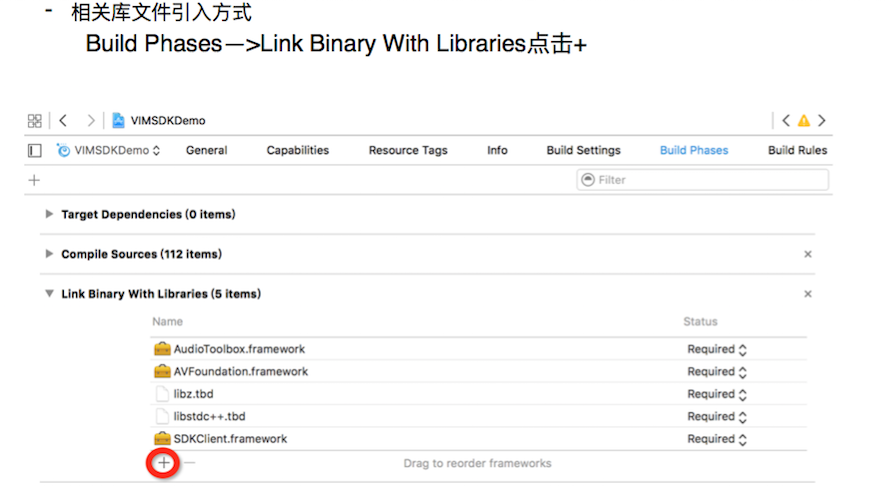
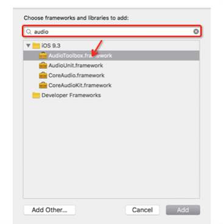
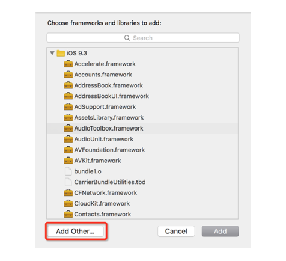
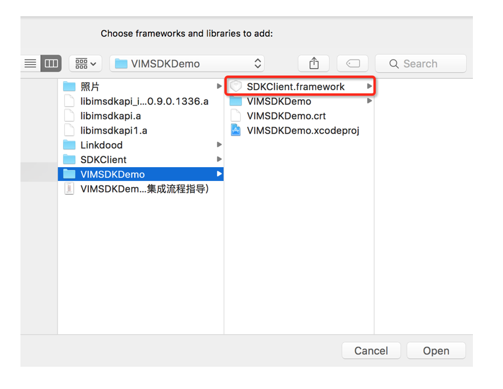
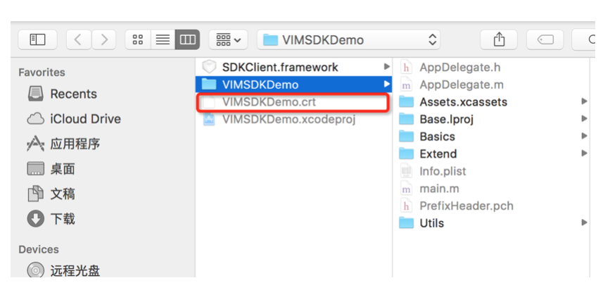
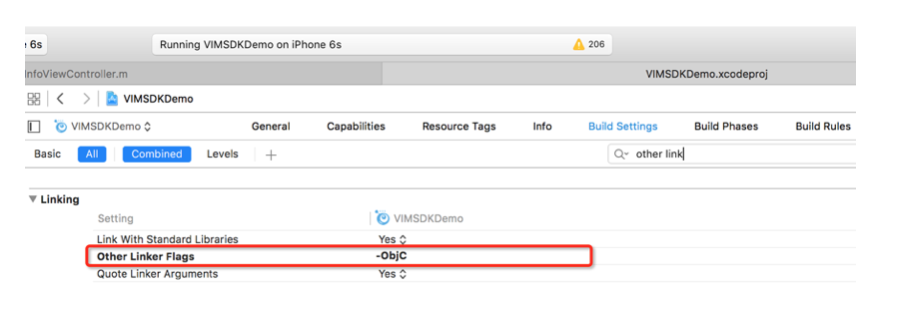
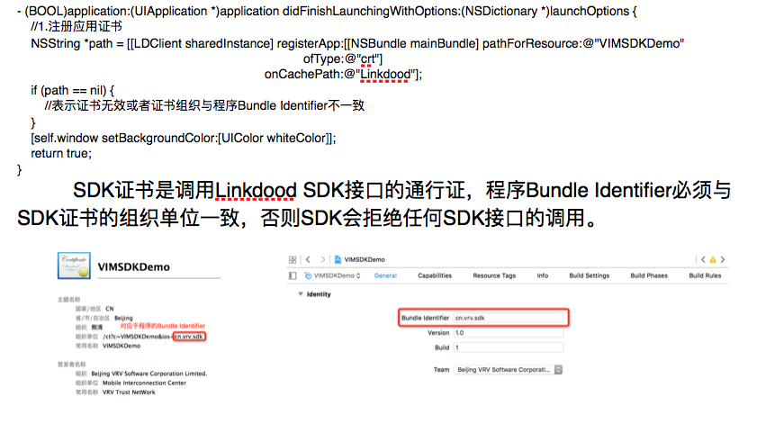

##iOS客户端集成

###Demo工程结构说明

**如上图，是VIMSDKDemo的完整工程目录结构，我们将其分成了四个模块：**

* **基础入门功能展示模块**

此模块主要包括本次VIMSDKDemo版本展示的基础功能，包括最近会话、联系人列表、联系人基本信息以及会话，具体功能实现请参看此部分代码。

* **进阶扩展功能展示模块**

此模块主要展示进阶扩展功能，不在此次VIMSDKDemo版本的展示范围，我们会尽快加入此模块代码。

* **依赖的第三方库或扩展**

此模块主要放置了所有引用到的第三方库和扩展文件，开发者可参考。

* **资源文件和配置文件**

此模块包含所有配置文件和引入的文件，其中引入的文件包括:Linkdood SDK库文件SDKClient.framework、Linkdood SDK库文件依赖的相关库文件(libz.tbd、libstdc++.tbd、AudioToolbox.framework、AVFoundation.framework)以及应用的SDK证书文件VIMSDKDemo.crt。

**另外xcode6以上版本新建工程不包含预编译文件.pch文件，此处的PrefixHeader.pch文件是手动加入的，VIMSDKDemo工程中加入.pch文件是为了方便引用Linkdood SDK头文件，开发者可参考。**

**手动加入.pch文件方式请参考:[http://www.jianshu.com/p/e6e0e3bbbf38](http://www.jianshu.com/p/e6e0e3bbbf38)**

###集成SDK的准备工作
####应用证书的申请
**应用证书申请地址:[http://www.linkdood.cn/server-linkdood/reg](http://www.linkdood.cn/server-linkdood/reg)**
####Linkdood SDK库文件的获取
**从我们的开发者中心可以下载到SDK库文件、VIMSDKDemo以及相关集成文档和API文档，下载地址:[http://blog.liandoudou.cn/doku.php?id=wiki:sdk](http://blog.liandoudou.cn/doku.php?id=wiki:sdk)**

###引入相关文件和依赖库
**集成Linkdood SDK，我们需要引入的文件包括：**

* **SDKClient.framework——>Linkdood SDK库文件**
* **AudioToolbox.framework——>音频文件解析工具包**
* **AVFoundation.framework——>视频流处理工具包**
* **libz.tbd———————————>支持压缩的链接库**
* **libstdc++.tbd————————>支持c++标准库链接**
* **VIMSDKDemo.crt———————>应用SDK证书文件**

**如何引用**

**弹出的窗口中搜索需要添加的库文件添加**

**如果是添加Linkdood SDK库文件则选择弹出窗口中的Add Other按钮**

**然后选择我们工程文件夹中的Linkdood SDK库文件**

**引入应用SDK证书**

* 将获取到的SDK证书拷贝到工程文件夹中，不限制目录。然后在工程目录Supporting Files下点击右键选择Add Files to ”工程名”，在弹出的窗口选择工程文件夹下的SDK证书文件。

**修改编译配置项**

* 由于Linkdood SDK是静态库，而且使用了Category（类别），所以需要加入部分配置项：
Build Settings—>Linking—>Other Linker Flags加入-ObjC

**注:相关解释说明请参看[http://blog.csdn.net/lxinl/article/details/9664807](http://blog.csdn.net/lxinl/article/details/9664807)**

###SDK的使用
1.引入Linkdood SDK头文件#import <SDKClient/SDKClient.h>为了方便使用VIMSDKDemo是通过预编译文件PrefixHeader.pch文件引入的，开发者可参考

2.注册应用

3.其他相关接口的调用请参看DEMO功能实现以及相关API文档

* 请参考文档[《IM基础功能(iOS)开发指南》](../iOS/describe.md)

