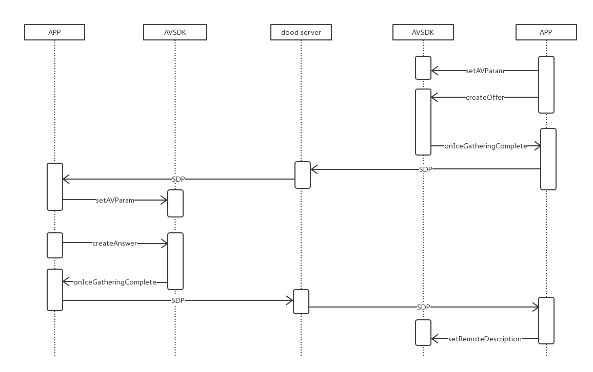

#RTCSDK概述

LinkdoodRTCSDK 是北信源软件股份有限公司为移动设备通话的即时通讯开发框架，实时通话分为语音通话和视频通话，将音频通讯进行数据流量化。

#RTCSDK功能

* 视频聊天（基本会话创建、控制、摄像头切换）
* 语音聊天（基本会话创建、控制、听筒外音切换、静音等功能）

#时序图

#RTCSDK接口与功能

void SetAVParam(const AVParam param);

#####功能：设置RTCSDK的参数

* paramLocalRender		本地SurfaceView
* paramRemoteRender		远端SurfaceView
* paramLocalLayout		
* paramRemoteLayout		
* paramActivity			
* paramIceServer		打洞服务器ip
* paramIcePort			打洞服务器端口
* paramIceUser			打洞服务器用户名
* paramIcePwd			打洞服务器密码
* paramOpenAudio		是否打开音频
* paramOpenVideo		是否打开视频

int RegisterUserCallBack(UserCallBack ulistener)
 功能：设置回调函数

int CreateOffer();
 功能：主叫端向被叫端发起音视频通话请求，生成SDP

int CreateAnswer();
 功能：被叫端接收到主叫端的SDP，做出响应并生成SDP

int SetRemoteDescription(String sdp);
 功能：主叫端接收到被叫端的SDP，并进行设置

void Destroy();
 功能：释放webRTC资源，在结束通话时使用

void SwitchCamera(bool enable);
 功能：切换摄像头

void SetMicrophone(boolean isEnableMic)
 功能：静音

void SetSpeaker(boolean isEnableSpeaker)
 功能：听筒外音切换

#回调

void onIceGatheringComplete(String sdp);
 功能：AVSDK将生成的SDP回调给应用层

void onIceConnected();
 功能：连接成功

void onIceDisconnected();
 功能：断开连接

void onPeerConnectionError(String description);
 功能：错误信息e